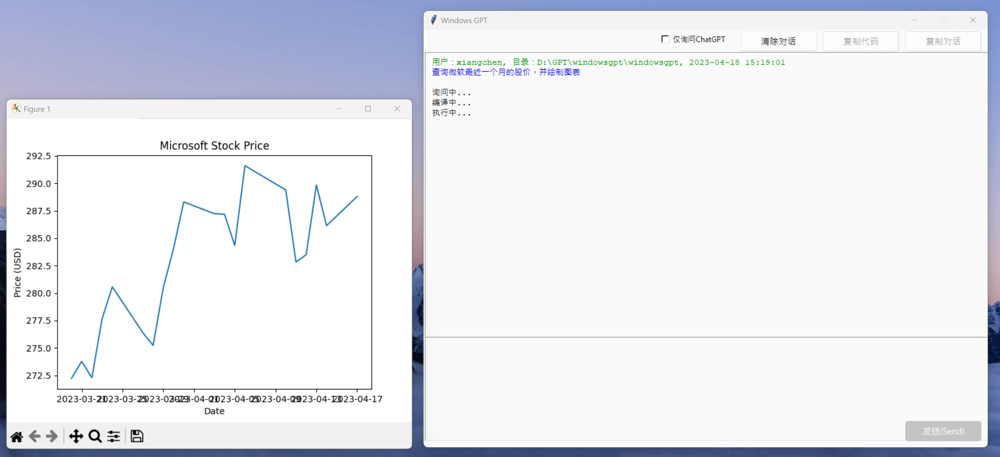
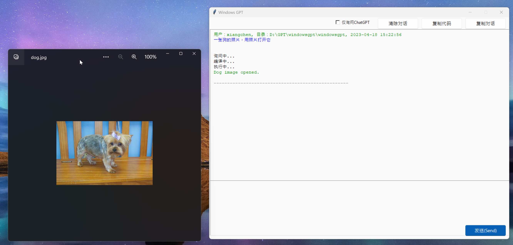
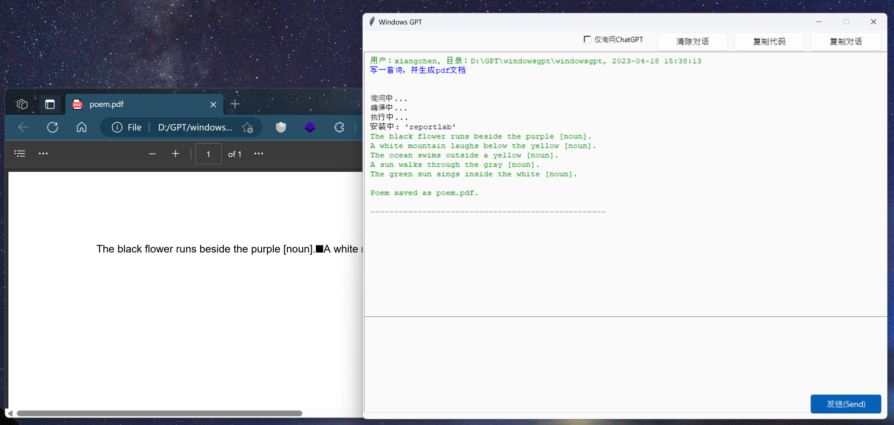
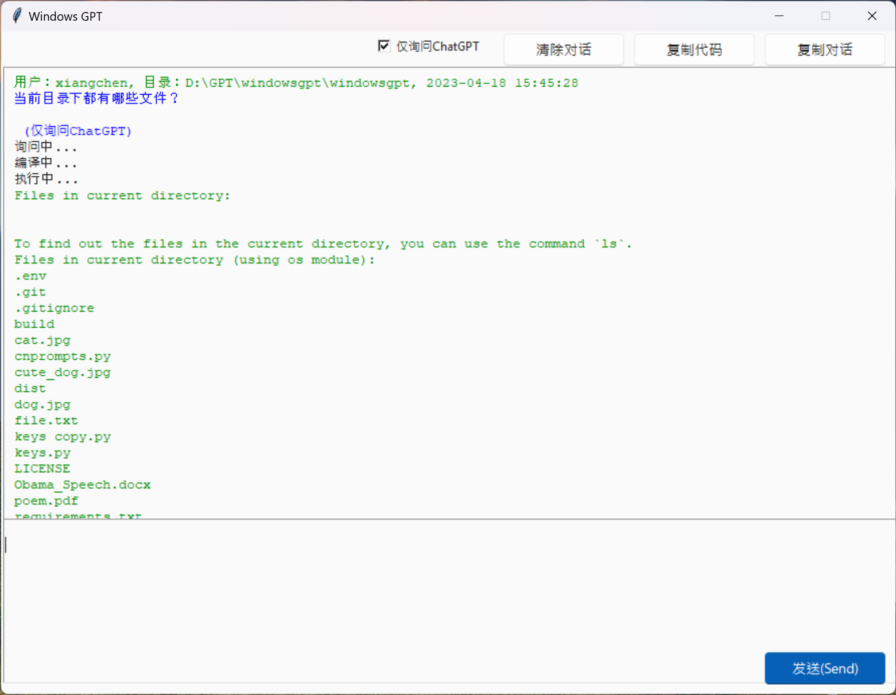

# WindowsGPT
一款Windows应用程序，可以通过ChatGPT让你与系统操作进行交互。

##### A windows app that allows you to use ChatGPT to interact with system operations.
### 安装 Install
```
pip install -r requirements.txt
```
### 运行 Run
```
python windowsgpt.py
```
## Demo
### 1. 联网并绘制图表 
##### Access Internet and plot graphs

想象一下你可以用jupyternotebook做什么，这里你也可以做到！

##### Imagine what you can do with jupyternotebook, here you can do it, too!
### 2. 从网络下载内容
##### Download images from Internet

把它想象成一个交互式的网络爬虫脚本。

##### Imagine this like an interactive web spyder script.
### 3. 生成文档，包括pdf，word，excel，txt等
##### Generate local documents

将其整合到您的工作流中！

##### Integrate this into your work flow!
### 4. 和操作系统交互
##### Work with operation system

但使用自然语言和命令行交流。

##### A commend line, but use natural language.
